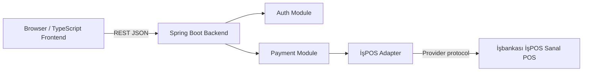
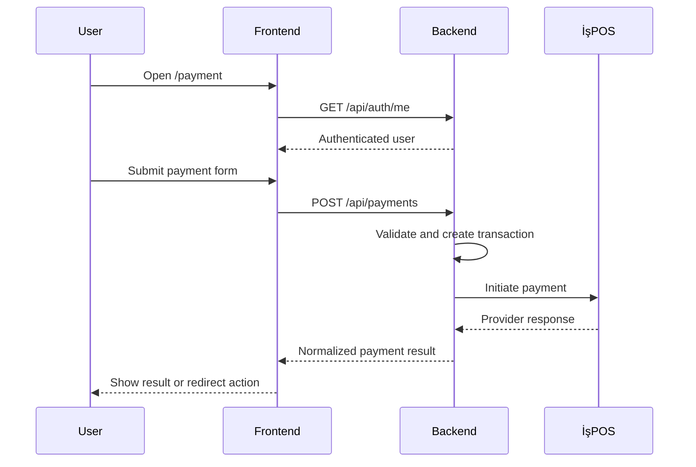

# Architecture

## Overview

The application is split into a TypeScript frontend and a Spring Boot backend.

## Frontend Responsibilities

- Render `/auth` and `/payment`.
- Keep route-level authentication guards.
- Collect user input.
- Run client-side validation for fast feedback.
- Send authenticated API requests to the backend.
- Display normalized backend results.

The frontend must not:

- Store provider credentials.
- Generate İşPOS hashes.
- Call İşPOS directly.
- Persist sensitive card data.

## Backend Responsibilities

- Authenticate users.
- Authorize access to payment APIs.
- Validate payment requests.
- Build İşPOS-specific payment requests.
- Sign/hash requests as required by İşPOS.
- Parse provider responses.
- Return normalized statuses to the frontend.
- Log transaction metadata without sensitive payment data.

## Backend Modules

### Auth

Owns login, logout, session/token validation, and current-user lookup.

### Payment

Owns payment request validation, transaction orchestration, and normalized API responses.

### İşPOS Adapter

Owns provider-specific fields, endpoint URLs, hashes/signatures, sandbox/live mode configuration, and response mapping.

### Common

Owns shared error models, validation helpers, exception handling, and observability helpers.

## Payment Flow

## Configuration Boundary

Use environment variables for:

- İşPOS mode
- İşPOS base URL
- Merchant/client ID
- Store key
- API username/password if required
- Callback and return URLs
- Frontend/backend public URLs
- Auth token/session settings
